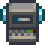

# ![*][junimo] {{ page.title }} ![*][junimo]
{: .no-print}
[junimo]: images/Junimo.gif

    <button onclick="setAllCheckboxes(true, 'input[type=checkbox].name-toggle')">Enable all names</button>
    <button onclick="setAllCheckboxes(false, 'input[type=checkbox].name-toggle')">Disable all names</button>
    <button onclick="setAllCheckboxes(false, '.item input[type=checkbox]')">Remove all progress</button>
    <button onclick="setAllCheckboxes(true, 'input[type=checkbox].visibility-toggle')">Show everything</button>

##  Save Slots:
{: .no-print}

    
    
        Slot {{ i }}:
        <button onclick="saveCheckboxes('{{ i }}')">Save</button>
        <button onclick="loadCheckboxes('{{ i }}')">Load</button>
    
    

    

    
    
    
    
    
    

    

    
    
    
    
    
    

    

    
    
    
    
    
    

    

    
    
    

    

    
    
    
    
    

    

    
    
    
    

    

    

    

    

    

    
    

